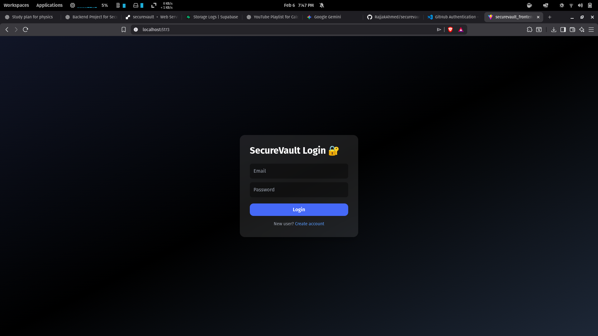
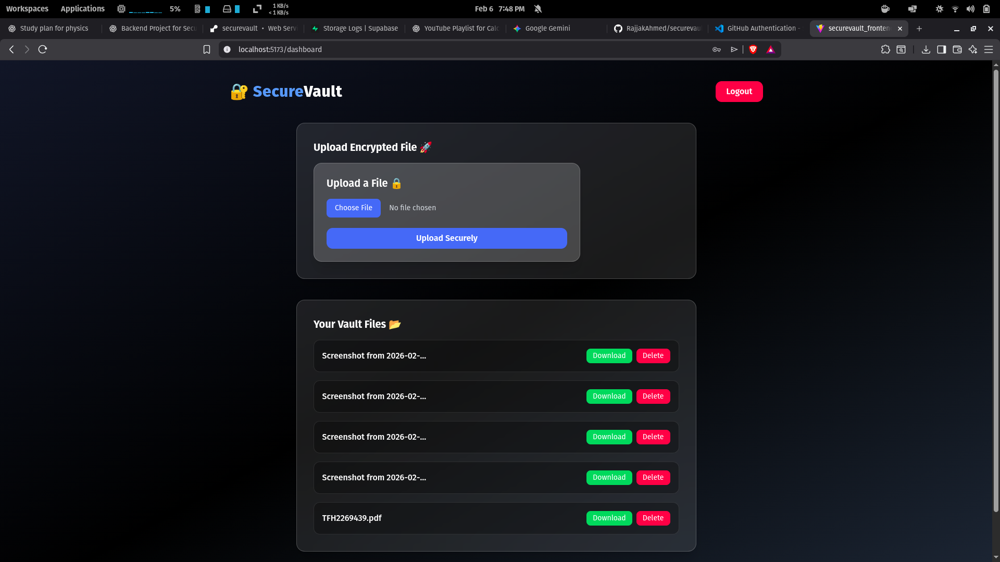

# 🔐 SecureVault Frontend (React + TypeScript)

A modern, secure, encrypted file vault frontend built with **React**, **TypeScript**, and **Tailwind CSS**, designed to work with the SecureVault backend API.

Users can:

✅ Register & Login  
✅ Upload encrypted files securely  
✅ View personal vault files  
✅ Download decrypted files  
✅ Delete files safely  
✅ Logout securely  

---


---

## 🖼️ Preview

> Modern Secure Dashboard UI

- Premium dark theme  
- Glassmorphism cards  
- Secure vault experience  



---

## ⚙️ Tech Stack

| Technology | Usage |
|----------|--------|
| **React + TypeScript** | Frontend framework |
| **Vite** | Fast development build tool |
| **Tailwind CSS** | Modern responsive UI |
| **Fetch API** | Backend communication |
| **JWT Auth** | Secure login session |
| **Supabase Storage** | Encrypted file storage |
| **Render Deployment** | Backend hosting |

---

## ✨ Features

### 🔑 Authentication
- User Register
- User Login
- JWT token stored securely in localStorage
- Logout functionality

### 📂 Vault Dashboard
- Upload files with encryption
- View uploaded files list
- Download decrypted files securely
- Delete files permanently

### 🎨 Modern UI
- Premium dark mode design
- Responsive layout
- Clean industry-style dashboard

---

## 📁 Folder Structure

```bash
src/
 ┣ api/
 ┃ ┣ auth.ts
 ┃ ┗ files.ts
 ┣ pages/
 ┃ ┣ Login.tsx
 ┃ ┣ Register.tsx
 ┃ ┗ Dashboard.tsx
 ┣ components/
 ┃ ┣ UploadBox.tsx
 ┃ ┗ FileList.tsx
 ┣ config.ts
 ┣ App.tsx
 ┗ main.tsx
